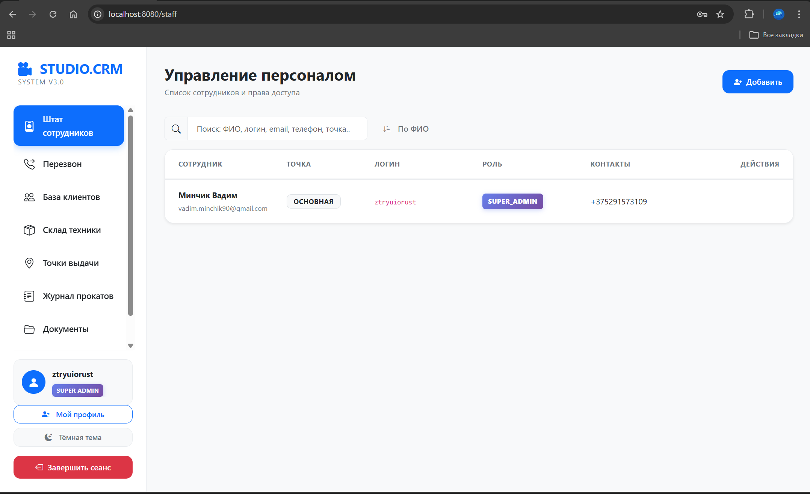
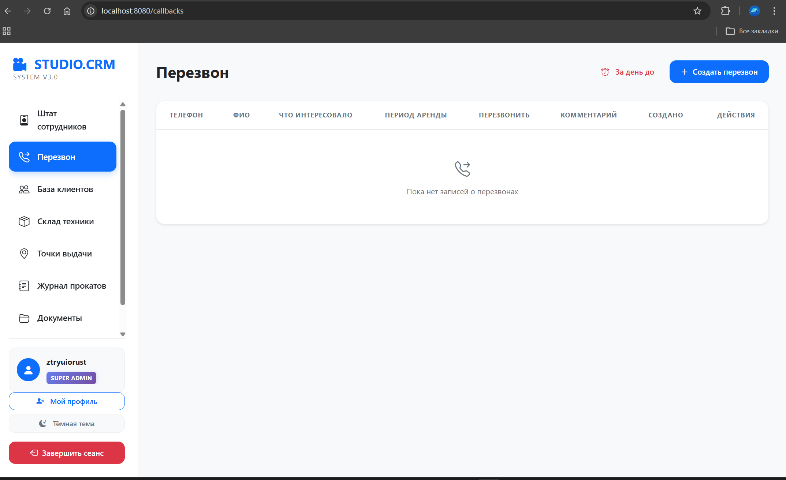
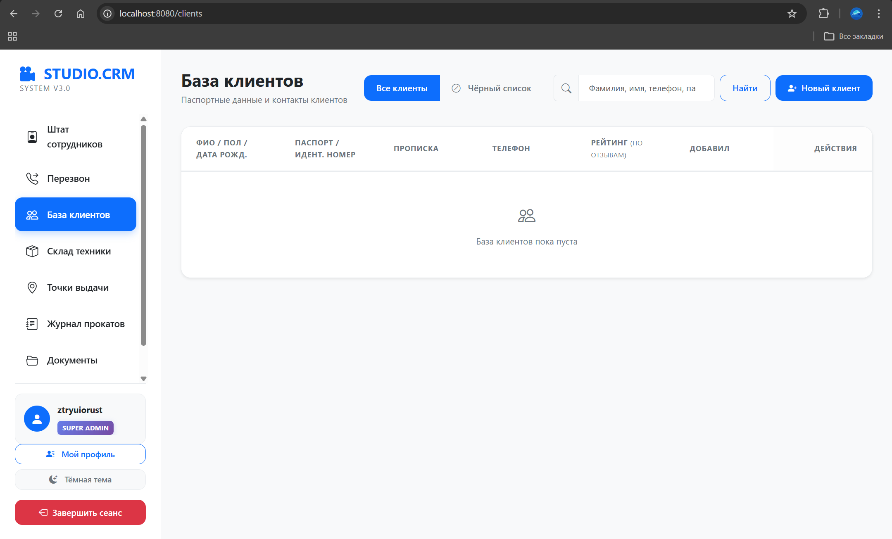
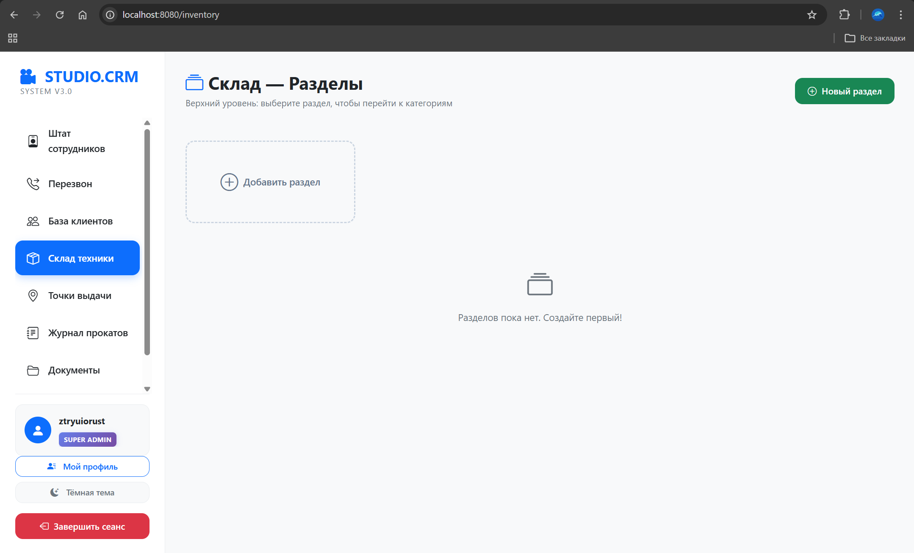
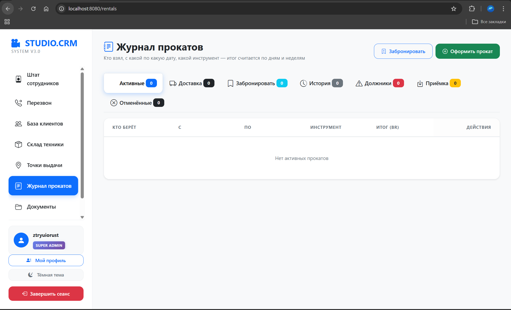
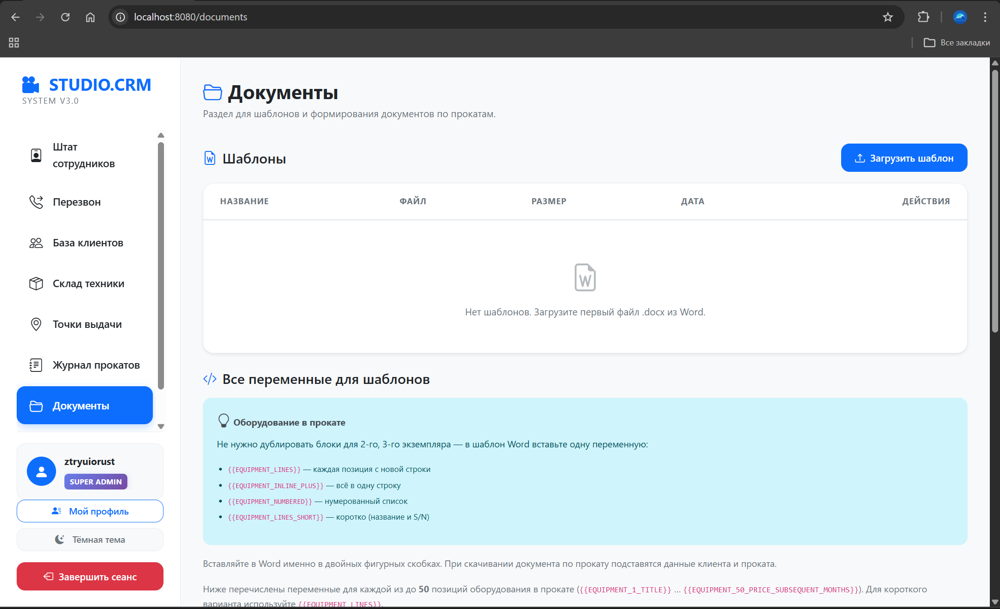
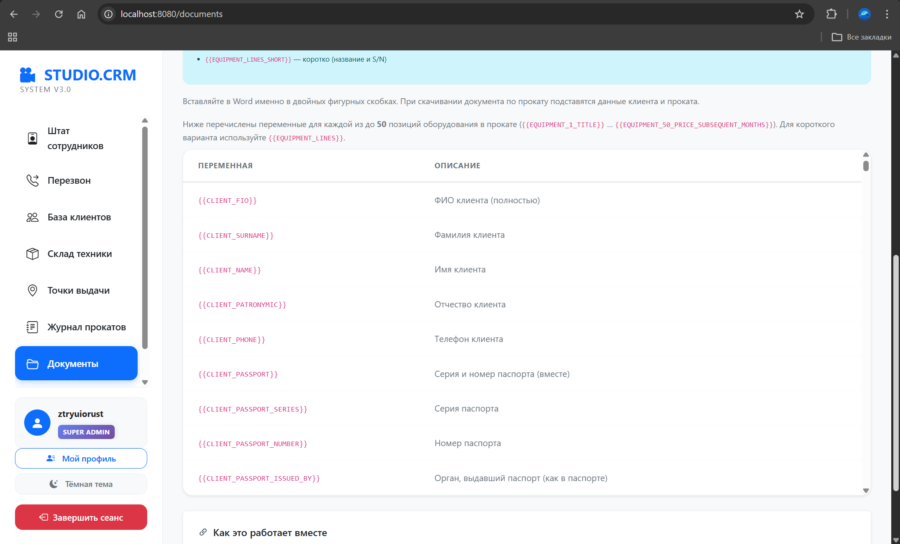
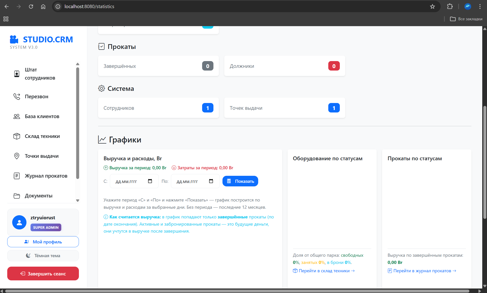
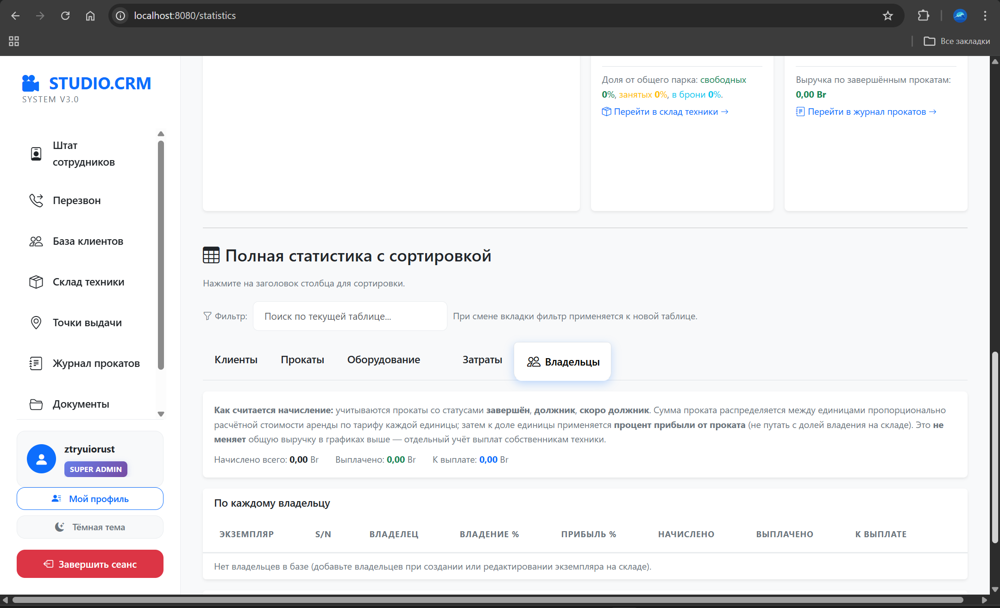

# CRM System

CRM для аренды/проката: клиенты, аренда, оборудование, точки, расходы, документы, статистика. **Spring Boot 4**, **Thymeleaf**, **PostgreSQL**, **Spring Security**. Интерфейс на русском, под контекст **РБ**.

Репозиторий: [github.com/vadim-minchik/crm-system](https://github.com/vadim-minchik/crm-system)

## Стек

Java 21 · Spring Boot · JPA/Hibernate · PostgreSQL · Thymeleaf · Apache POI · Maven (`mvnw`)

## Запуск в Docker

Нужен [Docker Desktop](https://www.docker.com/products/docker-desktop/) (движок **Engine running**). В корне проекта:

```powershell
docker compose up --build
```

Сайт: **http://localhost:8080** · пароль БД в контейнере: `docker-compose.yml` (`POSTGRES_PASSWORD` = `DB_PASSWORD`).

## Деплой (Render)

Для этого репозитория добавлен `render.yaml` (Blueprint). Коротко:

1. Push изменений в GitHub.
2. В Render: **New +** → **Blueprint** → выбрать репозиторий.
3. Render автоматически создаст:
   - web-service `crm-system` (из `Dockerfile`);
   - PostgreSQL `crm-system-db`.
4. После первого деплоя открыть URL сервиса.

> Почему не Vercel: проект — это stateful Spring Boot + PostgreSQL backend, а не serverless/frontend приложение.

### Прод-настройка перед первым запуском

`render.yaml` уже включает профиль `SPRING_PROFILES_ACTIVE=prod`.

Перед первым прод-запуском в Render добавь Environment Variables:

- `BOOTSTRAP_SUPER_ADMIN_ENABLED=true`
- `BOOTSTRAP_SUPER_ADMIN_LOGIN=<твой_логин>`
- `BOOTSTRAP_SUPER_ADMIN_PASSWORD=<сложный_пароль>`
- `BOOTSTRAP_SUPER_ADMIN_EMAIL=<твой_email>`
- `BOOTSTRAP_SUPER_ADMIN_PHONE=<твой_телефон>`

После первого входа и создания учётки:

1. Смени пароль в интерфейсе.
2. Поставь `BOOTSTRAP_SUPER_ADMIN_ENABLED=false`.
3. Сделай redeploy.

В `prod` профиле уже включены: secure-cookie, отключён SQL init и подробные stacktrace в ответах.

## Запуск локально (JDK + PostgreSQL)

1. **JDK 21**, **PostgreSQL**, база `crm_system`.
2. `application.properties` или `application-local.properties` (шаблон: `application-local.properties.example`).
3. `.\mvnw.cmd spring-boot:run` / `./mvnw spring-boot:run` → **http://localhost:8080**

## Тесты и сборка

```powershell
.\mvnw.cmd test
.\mvnw.cmd package -DskipTests
```

На GitHub: **Actions** — CI (`./mvnw test`) для веток `main` и `master`.

## Скриншоты

Кратко: боковое меню, светлая тема, модули **персонал → перезвон → клиенты → склад → прокаты → документы → статистика** (на демо списки часто пустые).

| Экран | Описание |
|--------|----------|
| Персонал | Таблица сотрудников, точка, роль, контакты |
| Перезвон | Очередь звонков, создание заявки |
| Клиенты | База, поиск, чёрный список |
| Склад | Разделы техники |
| Прокаты | Журнал, вкладки статусов, оформление |
| Документы | Шаблоны .docx и справка по `{{переменным}}` |
| Статистика | Карточки, графики, таблицы (в т.ч. владельцы) |











## Прочее

- [ER-диаграмма БД](docs/er-diagram.md) (Mermaid)
- Файлы: `app.storage.type=local` (папка `uploads`) или Supabase — см. пример в `application-local.properties.example`
