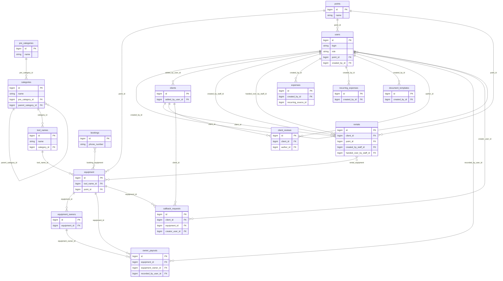

# ER-диаграмма (модель данных CRM System)

Диаграмма построена по JPA-сущностям в `src/main/java/com/studio/crm_system/entity`. Имена таблиц — как в `@Table(name = "...")`.

Связи **«многие ко многим»** реализованы таблицами **`rental_equipment`** и **`booking_equipment`** (отдельных сущностей в коде нет).

## Таблицы связей M:N

| Таблица | Колонки |
|---------|---------|
| `rental_equipment` | `rental_id` → `rentals.id`, `equipment_id` → `equipment.id` |
| `booking_equipment` | `booking_id` → `bookings.id`, `equipment_id` → `equipment.id` |

## Примечания

- У всех сущностей есть поля **`version`** (оптимистическая блокировка) и обычно **`is_deleted`** / флаги мягкого удаления — на диаграмме не показаны.
- В **`expenses.recurring_source_id`** хранится идентификатор строки **`recurring_expenses`** без JPA-`@ManyToOne` (слабая связь).
